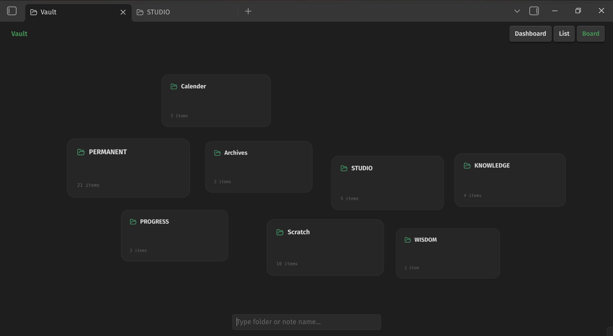
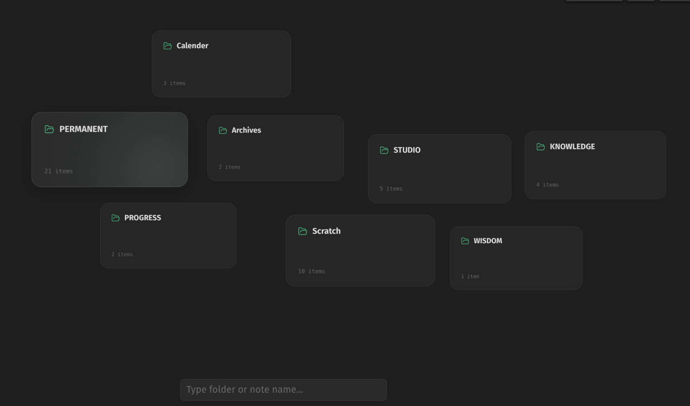
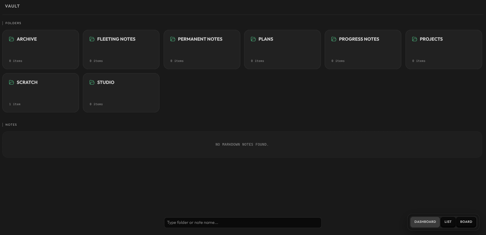
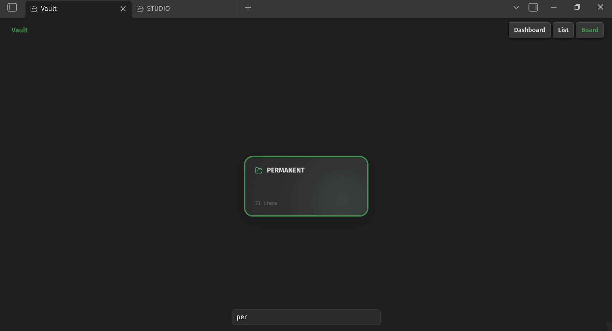

# Superwave — Obsidian

> A plugin and theme for minds that move fast.  
> Aligned with intuition. Cut the slow, cut the clutter — and feel what it means to just go.

---

## What is Superwave?

Superwave is a consolidated Obsidian plugin and theme built for **neurodivergent thinkers** — people who need their vault to respond fast, feel clear, and stay out of the way.

It bundles three systems into one:

- **Folder Dashboard** — a spatial, interactive view of your vault
- **Typewriter Mode** — a distraction-free writing focus system
- **Inferno Customizer Hub** — a unified styling and UI control panel

No scattered settings. One system, tuned for flow.
---
## Screenshots

**Board View**

_Interaction_

**Dashboard View**

**Search**

- search is always active.
- alt+shift to global file+folder search

---

## Features

### 🗂 Folder Dashboard

A full-screen, visual vault navigator — not just a file list.

- **Three views per folder:** Dashboard · List · Board
- **Board view** — spatial canvas with freely draggable cards; pan and zoom (25%–250%)
- **Dashboard view** — structured overview with Folders and Files sections
- **List view** — clean, scannable linear layout
- **Per-folder memory** — each folder remembers its last view mode and card positions
- **Live search** — always-active filter bar; type to instantly surface any file or folder
- **Breadcrumb navigation** — click any level to jump back instantly
- **Hotkeys:**
  - `Ctrl + Shift` → Jump to root folder
  - `Alt + Shift` → Global search (files and folders)
  - `M MOUSE` → on the breadcrumb, jump into file explorer (active dir)

---

### 🎨 Inferno Customizer Hub

One settings panel for everything visual.

**Interface Cleanup**
- Hide attachments folder from explorer (configurable folder name)
- Hide ribbon icons
- Hide search and bookmarks from header bar
- Hide file explorer top buttons

**Content Display**
- Mermaid diagram resize with configurable max-width
- Custom coloured callouts toggle
- Raw CSS override field for direct style injections

---

---

> *"A different way, built for minds that move fast."*

